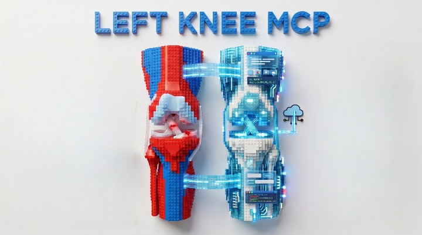
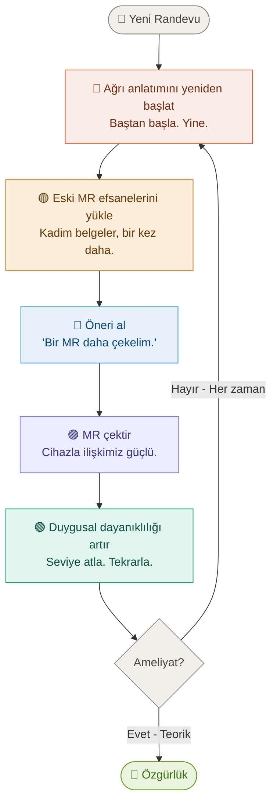
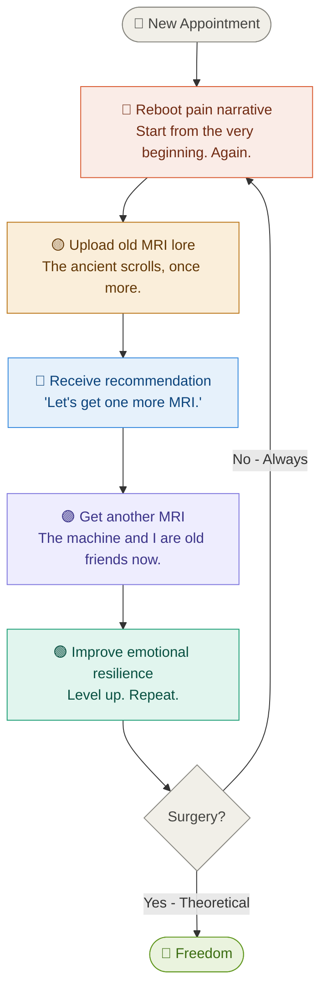

<p align="center">
  
</p>

<p align="center">
  
  
  
  
  
</p>

<p align="center">
  
  
  
  
</p>

---

# 🦴 Sol Diz MCP &nbsp;/&nbsp; Left Knee MCP

> _An AI-native, doctor-enablement platform for high-velocity clinical context transfer._
> _AKA: I got tired of re-explaining my knee._

---

## 🇹🇷 Türkçe

### 📖 Hikaye

**12 Ocak 2025** tarihinde bir _halı saha_ maçında sakatlandım.

O günden beri bir yılı aşkın süredir şu premium üyelik paketinin içindeyim:

> **"Yeni doktora git, her şeyi baştan anlat, bir MR daha çek."**

Standart randevu akışı şu şekilde ilerliyor:



Bu noktada MR cihazıyla olan ilişki metriklerim, birçok startup kurucu ortaklığından daha güçlü.

Bu yüzden yapılacak tek mantıklı ve ölçeklenebilir şeyi yaptım: **sol dizim için bir MCP sunucusu kurdum.**

---

### 🎯 Amaç

`left-knee-mcp`, yüksek hızlı klinik bağlam aktarımı için tasarlanmış, AI-native bir doktor etkinleştirme platformudur. Doktorlar kendi LLM'lerini diz zaman çizelgeme bağlayıp, her randevuda benden aynı hikayeyi canlı canlı dinlemek yerine anında yapılandırılmış içgörü alabilir.

| Özellik                          | Çözüm                       |
| -------------------------------- | --------------------------- |
| 🔁 Sonsuz hikaye döngüsü         | LLM destekli ön brifing     |
| 📋 MR geçmişi karmaşası          | Zaman çizelgeli özet        |
| 🤔 "Bir MR daha" refleksi        | Bağlam zengin karar desteği |
| 😮‍💨 Hasta her şeyi tekrar anlatır | Dramatik yük azaltımı       |

**Özetle:** daha az döngü, daha çok netlik, daha verimli görüşme.

---

### ▶️ Çalıştırma

```bash
npm install
npm start
```

---

## 🇬🇧 English

### 📖 Origin Story

On **12 January 2025**, I got injured during a _soccer_ match.

Since then, I have spent more than a year enrolled in a premium subscription plan called:

> **"See a new doctor, explain everything again, get another MRI."**

The standard appointment workflow currently looks like this:



At this point, my MRI machine and I have stronger relationship metrics than most startup co-founders.

So I did the only logical, scalable thing: **I created an MCP server for my left knee.**

---

### 🎯 Mission

`left-knee-mcp` is an AI-native, doctor-enablement platform for high-velocity clinical context transfer. Doctors can connect their LLMs to my knee timeline and instantly receive structured intelligence — instead of making me run the same human API call at every appointment.

| Problem                         | Solution                                |
| ------------------------------- | --------------------------------------- |
| 🔁 Infinite story loop          | LLM-supported pre-consultation briefing |
| 📋 Scattered MRI history        | Timeline-aware structured summary       |
| 🤔 "Just one more MRI" reflex   | Context-rich decision support           |
| 😮‍💨 Patient repeats entire story | Dramatically reduced repeat-overhead    |

**In short:** less loop, more clarity, better conversations.

---

### ▶️ Run

```bash
npm install
npm start
```

---

## 🗺️ Roadmap

- [x] MCP "hello world" server
- [ ] Structured knee injury timeline tool
- [ ] MRI history + findings tool
- [ ] Treatment attempts & outcomes tool
- [ ] Doctor pre-briefing prompt template
- [ ] Achieve a doctor visit without saying "so it started in January 2025..."

---

<p align="center">
  <sub>Built with 🦴 and existential determination &nbsp;|&nbsp; <b>Sol Diz MCP</b> &nbsp;|&nbsp; Ankara, 2026</sub>
</p>
